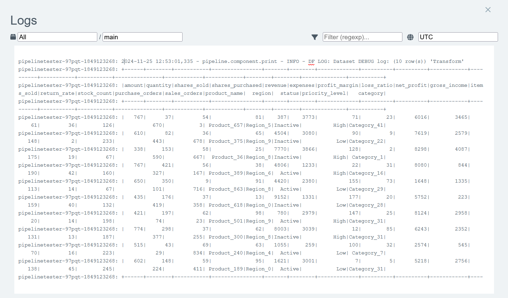
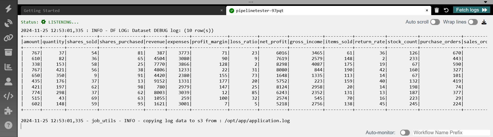
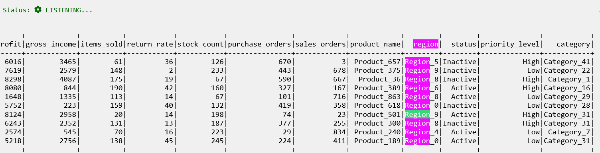
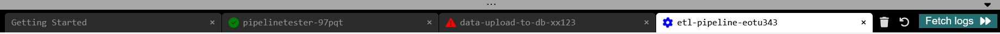
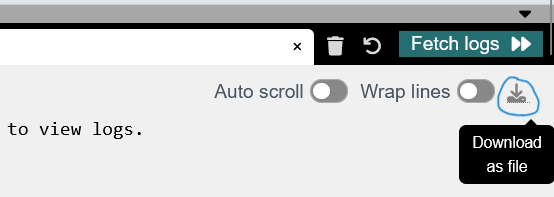
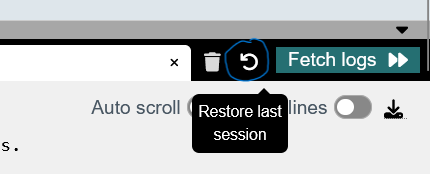
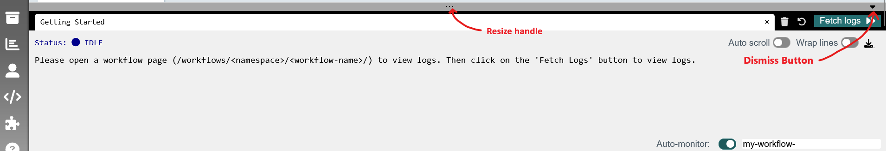

# Log Viewer for Argo™ Workflows

This is a browser extension to enhance the log viewer in [Argo Workflows UI](https://argoproj.github.io/workflows/).

## Features

- Ability to use the browser's in-built search function
- Download logs to a text file
- Ability to disable word-wrap on logs
- Tab support, monitor multiple workflows at the same time (current status, logs etc.)
- Automatically start listening for workflows based on a pattern (no more missed logs)
- Logs are no longer lost once a workflow completes
- Can recover older workflow logs (even after browser restarts)

### No Word wrap

We can now view multi-line content in it's intended format. This is useful for viewing multi-line stack traces, and dataset print logs. For example, trying while trying to `df.show()` on a  dataset:

Originial Argo Workflows UI:
<br>


Log Viewer for Argo Workflows (extension)<br>

<br>
<br>

A toggle switch is provided on the toolbar to turn word-wrap back on if required.

### Use built-in search and copy

We can now use the browser’s built-in search, selection, and copy functionalities!



### Monitor multiple workflows at once

We can monitor logs and status (Pending, Running, Failed/Success) for multiple workflows at the same time.



### Download logs

We can download the logs for a pipeline and save them to a text file at any time.



### Auto-monitor workflows

Never miss the logs for a workflow run again! Just give a prefix string in the bottom right (e.g. `my-workflow-`)\
The extension will listen for new pipelines in the background, and if any pipeline name starts with the pattern specified, it will start saving logs automatically.


### Recover unsaved logs

Logs now persist across page navigation, workflow completion, and even browser restarts! If you’re monitoring a workflow, and you accidentally closed the tab/browser, you can still recover the logs using the "Restore last session" button on the top right



## Quick Start

- After installing the extension, open the Argo Workflows UI.

- Now click on the extension icon, it should inject the log viewer into the current page. You should see an “Open logs” button on the bottom-right. You will also see an "Injecting Log Viewer for Argo Workflows" message in the console.

- Open the Argo workflows page, and click on the "Open logs" button.


- This should open a footer from the bottom.

- You can adjust the height of the footer by using the grey resize handle on top



- Open any running workflow.

- The URL should be similar to this: `https://<argo-url>/workflows/argo-namespace/workflow-name-xxxx?tab=workflow`

- Now click on the "Fetch logs" button.

- This should open up a new tab in the footer, and logs should start appearing in the window below.

*NOTE: The “Fetch Logs” button will not work on the all workflow list page (/workflows/), it will only start monitoring when a particular workflow page is open.*

## Installation

### From Public Stores

Install directly from official stores:

* Firefox: [https://addons.mozilla.org/en-GB/firefox/addon/log-viewer-for-argo-workflows/](https://addons.mozilla.org/en-GB/firefox/addon/log-viewer-for-argo-workflows/)
* Chrome: [https://chromewebstore.google.com/detail/log-viewer-for-argo-workf/cfhckecoelooagejlbpbmhbhhhlcooal](https://chromewebstore.google.com/detail/log-viewer-for-argo-workf/cfhckecoelooagejlbpbmhbhhhlcooal)

### Download and install manually

You can download the latest release for your browser from the [releases](https://github.com/arcesium/log-viewer-for-argo-workflows/releases/latest) section.

To install the extension from the downloaded folder locally, follow the steps here:
- [Mozilla Firefox](https://extensionworkshop.com/documentation/develop/temporary-installation-in-firefox/)
- [Google Chrome/Chromium derivatives](https://developer.chrome.com/docs/extensions/get-started/tutorial/hello-world#load-unpacked)

### Build locally

To generate the extension zips/folders, run the script `generate_plugins.sh`.\
This will generate two versions of the extension (one for manifest v2 and one for v3).

```sh
# For Mozilla Firefox
build/firefox/v2

# For Google Chrome/Microsoft Edge/Chromium derivatives
build/chrome/v3
```

## Known bugs/enhancements

- The state of the "Fetch Logs" button should accurately depict whether the log listener is active.
- The entire Argo Workflows page should compress itself when the extension in injected, so that the footer doesn't cover up important UI elements.
- Newer logs are no longer saved across restarts: This is because we’re using localstorage, which has a 2MB limit in most browsers. Please close some older tabs to free up memory.
(will switch to IndexedDb in future versions to remove memory limit)
- Can only monitor workflows at the parent level, cannot monitor individual child nodes. (Logs from all child nodes are combined)
- Cannot track status of child nodes. Parent node status decides whether a workflow is Pending/Running/Completed etc.

## Contributing

To contribute, open a [pull request](https://github.com/arcesium/log-viewer-for-argo-workflows/pulls).

### Sign your work

All commits must be signed to be accepted. Your signature certifies that you have the right to submit your contribution(s) to the project, in accordance with the principles described in the [Developer Certificate of
Origin](https://developercertificate.org/).

```txt
Developer Certificate of Origin
Version 1.1

Copyright (C) 2004, 2006 The Linux Foundation and its contributors.

Everyone is permitted to copy and distribute verbatim copies of this
license document, but changing it is not allowed.


Developer's Certificate of Origin 1.1

By making a contribution to this project, I certify that:

(a) The contribution was created in whole or in part by me and I
    have the right to submit it under the open source license
    indicated in the file; or

(b) The contribution is based upon previous work that, to the best
    of my knowledge, is covered under an appropriate open source
    license and I have the right under that license to submit that
    work with modifications, whether created in whole or in part
    by me, under the same open source license (unless I am
    permitted to submit under a different license), as indicated
    in the file; or

(c) The contribution was provided directly to me by some other
    person who certified (a), (b) or (c) and I have not modified
    it.

(d) I understand and agree that this project and the contribution
    are public and that a record of the contribution (including all
    personal information I submit with it, including my sign-off) is
    maintained indefinitely and may be redistributed consistent with
    this project or the open source license(s) involved.
```

To sign your commits, use the template below to generate a signature, and then
add that signature to your commit message(s):

```txt
Signed-off-by: Your Name <Your.Name@example.com>
```

You must use your true name. Pseudonyms are not permitted.

If you have set `git`'s `user.name` and `user.email`, you can sign commits
easily at commit time using `git commit -s`.
